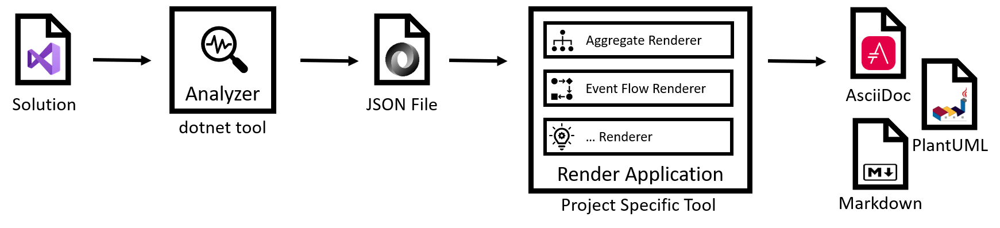

# Living Documentation

 

| Package | Type | Status
|-|-|-|
| Analyzer Tool | Released | [](https://www.nuget.org/packages/LivingDocumentation.Analyzer)
| Analyzer Tool | Preview | [](https://dev.azure.com/hompus/LivingDocumentation/_packaging?_a=package&feed=030d64ca-8fad-4972-b7b7-8b1679c95e25&package=f3b0fbae-213f-412b-a98c-4d339e7a09e7&preferRelease=false)

---

> Use your source code to document your application

// TODO: Write more explaination

Session given at NDC London 2023 that covers examples using this tool

[](http://www.youtube.com/watch?v=hf8hzGb2C6E)

## Install the analyzer

The analyzer is a dotnet global tool.

```sh
dotnet tool install --global LivingDocumentation.Analyzer
```

## Generating documentation

Using LivingDocumentation to generate documentation follows the following process flow:


1. Run the LivingDocumentation.Analyzer with your Visual Studio solution file as input. The tool will analyze all source code in the solution, and generate an intermediate JSON file as output containing all classes, interfaced, enums, etc.
2. You create a "render application" where you use the JSON file as input, and you are able to create all kinds of views on your source code. Like aggregate class diagrams, event flow sequence diagrams, etc.
3. Output your diagrams, text, etc. in text-based formats, like Markdown, AsciiDoc and PlantUML.

Both during local development, as during your CI&CD pipeline, can follow the same flow.

### Local development

The analysis of a solution might take quite "long" (30s - 90s). Therefore we create an intermediate JSON file, so you only need to do rerun the analysis if your source solution changes.
Generating the documentation takes less than a second. So you can have a fast feedback loop when developing your _renderers_ as you don't need to recreate the JSON file every time.

## Develop your own renderers

A renderer application can be as simple as a command line tool that takes in the generated JSON files, makes conclusions based on the type information and writes this to a plain text file format.

To be able to quickly start your should make a dependency on the NuGet packages.

### NuGet package overview

This is a hierarchical list of all NuGet packages and their contents & purpose.

* **LivingDocumentation.RenderExtensions**

  This package contains extension methods and dependencies on all types that describe the serialized analysis of the solution.

  * **LivingDocumentation.Descriptions**

    This package contains all classes that describe the analyzed solution, like types, methods, xml comments, etc.

    * **LivingDocumentation.Abstractions**

      This package contains interfaces, base classes, and enums.

    * **LivingDocumentation.Extensions**

      This package contains extension methods.

  * **LivingDocumentation.Statements**

    This package contains all classes that describe the statements in the analyzed solution, like foreach, if/else, switch, etc.

* **LivingDocumentation.Json**

  This package contains the Json serializers and contract resolvers to deserialize the generated JSON file.

* **LivingDocumentation.UML**

  This package contains a lot of supporting methods to make it easier to build valid PlantUML output.

## Running the sample

These steps expect the **eShopOnContainers** and **LivingDocumentation** repos to be subdirectories of the location where you execute these commands:

```plain
|
+-- eShopOnContainers
+-- LivingDocumentation
```

1. Install the analyzer as a global tool
2. Make sure you've build the solution you want to document

   ```sh
   dotnet build eShopOnContainers/eShopOnContainers-ServicesAndWebApps.sln -c Release
   ```

3. Run the analyzer and store the intermediate output

   ```sh
   livingdoc-analyze --solution eShopOnContainers/eShopOnContainers-ServicesAndWebApps.sln --output analysis.json
   ```

4. Run you project specific renderer

   ```sh
   dotnet run --project LivingDocumentation\samples\LivingDocumentation.eShopOnContainers -c Release
   ```
